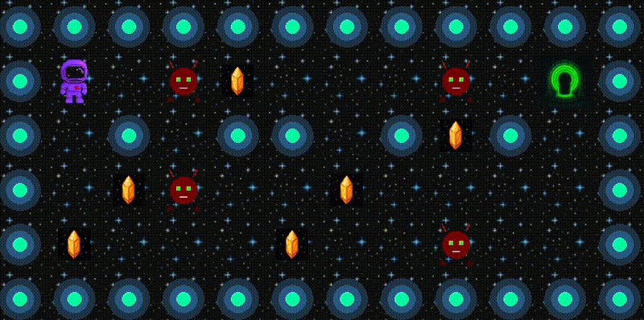

# so_long

## 🎥 Demo
<p align="center">
  
</p>

**so_long** is a small 2D game developed as part of the 42 school curriculum.  
The objective is simple: **collect all collectibles on the map and then reach the exit**.  
The project focuses on working with the MiniLibX graphics library, event handling, textures, sprites, and clean C programming following the Norminette rules.

---

## 📌 Project Overview

This project aims to:
- Practice **window management** and **event handling**.
- Learn to work with **textures and sprites** in a 2D environment.
- Handle **map parsing**, **validation**, and **pathfinding**.
- Implement **modular and clean C code** with proper memory management.

---

## 🎮 Game Rules

- The game reads a `.ber` map file as input.
- The player can move using **WASD** or **arrow keys**.
- The goal is to **collect all collectibles (`C`)** before going to the exit (`E`).
- The player **cannot walk through walls (`1`)**.
- The game ends when:
  - The player reaches the exit **after collecting all collectibles**.
  - Or when the user presses **ESC** or closes the window.
- A **move counter** is displayed in the terminal for each move.

---

## 🗺 Map Format

Maps must follow these rules:

| Symbol | Meaning                |
|--------|------------------------|
| `0`    | Empty space            |
| `1`    | Wall                   |
| `C`    | Collectible            |
| `E`    | Exit                   |
| `P`    | Player starting point  |

Example of a valid map:

<pre>
|--------|
| 111111 |
| 1P0C01 |
| 100001 |
| 1C0E01 |
| 111111 |
|--------|
</pre>


**Validation rules:**
- Must be **rectangular**.
- Must be **surrounded by walls**.
- Must contain **1 `P`**, **1 `E`**, and at least **1 `C`**.
- No invalid characters.
- All collectibles and the exit must be reachable.

---

## ⚙️ Features Implemented

- **Map parsing** from `.ber` files.
- **Validation** of map shape, borders, and characters.
- **Flood fill pathfinding** to ensure map solvability.
- **Sprite-based rendering** with MiniLibX.
- **Smooth window management** (minimize, restore, close).
- **Player movement logic** with collision detection.
- **Clean exit** handling (ESC key, window close button).
- **Full memory management** (no leaks).

---

## 📂 Project Structure

<pre>
so_long/
├── <a href="include">include</a>                  # Header file
├── <a href="src">src</a>                          # Source code
│   ├── <a href="src/map_parser.c">map_parser.c</a>       # Reads and stores map in memory
│   ├── <a href="src/map_validator.c">map_validator.c</a>   # Checks map rules
│   ├── <a href="src/map_path.c">map_path.c</a>           # Flood fill reachability check
│   ├── <a href="src/map_utils.c">map_utils.c</a>         # Helper functions
│   ├── <a href="src/game_init.c">game_init.c</a>         # Initializes game state and loads textures
│   ├── <a href="src/mlx_setup.c">mlx_setup.c</a>         # Initializes mlx library
│   ├── <a href="src/sprites.c">sprites.c</a>             # Load the game sprites (images)
│   ├── <a href="src/render.c">render.c</a>               # Renders map to the window
│   ├── <a href="src/moves.c">moves.c</a>                 # Player movement logic
│   ├── <a href="src/exit_game.c">exit_game.c</a>          # Frees memory and closes the game
│   ├── <a href="src/main.c">main.c</a>                   # Entry point
├── <a href="maps">maps</a>                        # Example maps (valid and invalid)
├── <a href="assets">assets</a>                    # Sprites / IMG
├── <a href="lib/MLX42">lib/MLX42</a>               # MiniLibX library(linux and mac)
├── <a href="custom_libs">custom_libs</a>             # Custom libraries (libft, ft_printf, get_next_line)
└── <a href="Makefile">Makefile</a>
</pre>


---

## 🛠 Compilation & Usage

### **Requirements**
- **Linux** or **macOS**
- **MiniLibX** (included in `lib/`)
- **gcc** or **cc** compiler

### **MLX42 Library**

This project includes two versions of the MLX42 library:
- **Linux:** `lib/mlx_linux`
- **macOS:** `lib/mlx_mac`

The Makefile automatically detects your OS and builds the correct version.

#### **Linux dependencies**
Before compiling on Linux, you must install GLFW and X11 development libraries:
```bash
sudo apt-get update
sudo apt-get install cmake gcc make libx11-dev libglfw3-dev libglfw3 xorg-dev
```

#### **macOS dependencies**
On macOS, make sure you have Xcode Command Line Tools and install GLFW via Homebrew:
```bash
xcode-select --install
brew install glfw
```

### **Build the project**
```bash
make

### **Run the game**

./so_long maps/valid.ber
